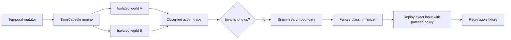

# TimeCapsule

<p align="center">
  
</p>

<p align="center"><strong>Temporal reliability for stateful agent workflows.</strong><br>Explore alternate futures, isolate the ones that break, and replay the same input against a patch.</p>

<p align="center">
  <a href="actions/workflows/timecapsule.yml"></a>
  <a href="https://nextjs.org/docs/app"></a>
  <a href="https://www.python.org/"></a>
  
</p>

> Find the futures where the collections policy fails before your users do.

TimeCapsule treats the future as a fuzzing surface. It explores payment,
dispute, webhook, and wakeup timelines; checks a safety invariant; finds the
failure boundary; minimizes the counterexample; and replays the exact same
future against a patched agent.

This repository contains the complete product example: a deterministic Python
engine, an isolated browser execution path, a Python API, and a polished
Next.js dashboard. Start locally in seconds, inspect a concrete failure, then
promote the minimized future into a regression fixture.

### Scope, stated precisely

The current implementation demonstrates this loop on one deterministic
collections scenario, with one built-in original policy and one built-in patched
policy. Its evidence proves that this candidate policy change fixes the
discovered temporal failure. It is not an arbitrary-agent runner or a
commit-level patch verifier.

## See it in 90 seconds

```bash
git clone https://github.com/qeinstein/solari-cookbook.git
cd solari-cookbook/examples/timecapsule-py
python3 -m venv .venv
source .venv/bin/activate
pip install -r requirements.txt
npm ci --prefix dashboard
python3 dashboard/dev.py --run demo/solari-canonical.json
```

Open [http://127.0.0.1:3000](http://127.0.0.1:3000), then:

1. Open a red branch and inspect the contradiction: payment `PAID`, CRM
   `OVERDUE`, agent belief `OVERDUE`.
2. Click **Minimize** to collapse it to a three-event counterexample while
   preserving the failure class.
3. Read the **failure boundary**, narrowed to the first failing minute.
4. Click **Replay exact input** and watch original `FAIL` become patched `PASS`
   without changing the event fingerprint.
5. Select a green branch to inspect a safe future too.

That is the product loop: **FAIL → MINIMIZE → PATCHED PASS**, with the input and
causal state visible rather than implied.

The **Replay theatre** keeps the observable policy path beside the browser
state, so the run can be understood at a glance or screen-recorded for a demo.

## The product loop

| Stage | What TimeCapsule proves |
| --- | --- |
| **Explore** | Deterministic seeds and coverage-guided mutations reach diverse temporal states. |
| **Inspect** | A future tree, ordered action trace, and causal state explain what happened. |
| **Minimize** | Delta debugging finds the smallest timeline while preserving the selected failure class. |
| **Locate** | Binary search identifies the first failing webhook delay at one-minute resolution. |
| **Replay** | Original and patched policies receive the same canonical input fingerprint. |
| **Regress** | A minimized counterexample becomes a checked-in JSON fixture. |

## The scenario

The vulnerable collections agent trusts stale CRM records. A customer payment
updates the payment system immediately, but the payment webhook arrives later.
Separately, a dispute can be open in the dispute service while its CRM mirror
is still unaware. If the agent wakes during either interval, it sends an
incorrect overdue reminder.

The patched policy verifies the payment source before contacting the customer.
TimeCapsule makes the race explicit and checks this invariant:

```text
no_contact_while_external_state_is_stale
```

The design is intended to extend to support entitlements, billing state, deploy
rollbacks, incident acknowledgements, and other workflows where an agent acts
while state is propagating across systems and time. Those extensions are not
implemented in this example.

## Architecture



The search begins with deterministic seeds, then mutates payment delay,
dispute timing, webhook delay, and wakeup placement. A candidate is retained
when it contributes novel event kinds, adjacent event pairs, temporal windows,
delay buckets, wakeup counts, or failure signatures. Selected futures form a
parent/child tree with a recorded shared event prefix.

Every run binds its ordered event input with a SHA-256 fingerprint. The
counterfactual replay checks the same input, world contract, asset hash,
fixture, and initial state while changing only the policy under test.

## Evidence you can inspect

Every failing future carries evidence that can be inspected in the dashboard
or saved as JSON:

- canonical event input and its SHA-256 fingerprint;
- ordered browser action trace with state captured at every event boundary;
- final state, sent-message count, invariant result, and failure class;
- last passing and first failing delay for each searchable boundary;
- mutation parent, operator, novel coverage, and shared event prefix;
- original/patched comparison with fresh runtime identifiers;
- browser/simulator parity checks for state, messages, and violations;
- replay recording keyframes when a recording is available.

The cloud path fails closed: incomplete traces, state disagreement, input
drift, or a non-fresh counterfactual runtime cannot be reported as a trusted
PASS.
An `ERROR` means the environment did not complete; it is neither a failed
invariant nor a passing replay, and the partial run remains persisted.

## Search benchmark

The benchmark is part of the evidence, not a marketing claim. Across 200
paired seeds, both strategies received exactly 128 unique candidate
evaluations per trial:

| Strategy | Unique behaviors p25 / median / p75 | Rare hit rate | First rare failure p25 / median / p75 (hits) |
| --- | ---: | ---: | ---: |
| Random mutation | 92 / 95 / 98 | 86.5% | 12 / 29 / 53 |
| Coverage-guided | 97 / 99 / 103 | 91.0% | 12 / 30.5 / 61 |

Guidance won the paired breadth comparison 151–42, with 7 ties. For the rare
failure's first appearance, random won 58 pairs, guidance won 55, and 49 tied
among the 162 pairs where both found it. The honest conclusion is that
coverage guidance broadens the explored surface and slightly raises rare-target
hit rate, but this run does not prove that it finds rare failures faster.

See the full [search comparison report](benchmarks/timecapsule-search-comparison.md)
for the protocol, distributions, and limitations.

The checked-in [canonical cloud run](examples/timecapsule-py/demo/solari-canonical.json)
contains a safe branch, payment-staleness and dispute-contact failures, two
patched passes, and five recorded browser replays. It opens without a cloud key
so the complete evidence path is immediately reviewable from a fresh clone.

## Optional cloud execution

Local proof and deterministic tests work without an account or API key. Keep
the credential server-side and never commit it or expose it to the browser:

```bash
cd examples/timecapsule-py
source .venv/bin/activate
export TIMECAPSULE_CLOUD_KEY=your_key_here
npm ci --prefix dashboard
python3 main.py cloud --futures 3 --concurrency 1 --max-environments 6 --output runs/cloud-latest.json
python3 dashboard/dev.py --run runs/cloud-latest.json
```

Each future creates and destroys its own isolated world and browser pair. The
JSON output includes the input fingerprint, violation snapshot, runtime IDs,
preview URL, observed action trace, recording status, and original/patched
evidence. `--concurrency 1` is the safe default for a new or low-limit account.
The environment ceiling is checked before any remote resource is created; the
worst-case cost is two environments per future because only original failures
receive a patched replay.

## Documentation and layout

The [full TimeCapsule guide](examples/timecapsule-py/README.md) contains the
dashboard API routes, command-line replay workflow, verification commands,
recording behavior, and the honest production boundary.

```text
├── examples/timecapsule-py/
│   ├── assets/             # Product banner and static visual assets
│   ├── dashboard/          # Next.js App Router frontend + Python API
│   ├── demo/               # Canonical recorded cloud run and replays
│   ├── regressions/        # Minimized, checked-in failure futures
│   ├── timecapsule/        # Deterministic engine and execution adapters
│   ├── world/              # Browser-drivable temporal world
│   └── tests/              # Product-loop and API checks
├── benchmarks/             # Reproducible search comparison report
└── .github/workflows/       # Backend and frontend CI
```

## Honest production boundary

This is a verified technical submission and single-operator demo, not a
multi-tenant hosted service. Before putting untrusted users behind it, add
durable run storage, authentication and per-user isolation, a background job
queue, structured logs and metrics, secret management, recording retention,
credentialed browser smoke tests, runtime-limit awareness, and explicit
artifact versioning.

MIT licensed.
