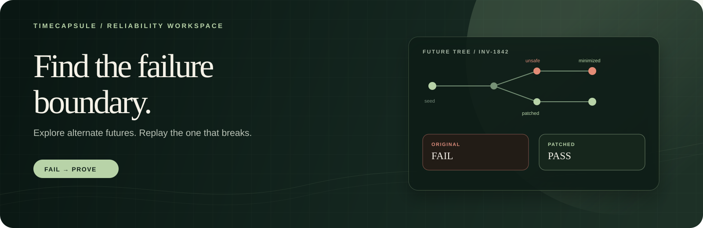
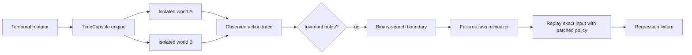

# TimeCapsule

<p align="center">
  
</p>

<p align="center"><strong>Temporal reliability testing for AI agents.</strong><br>Explore alternate futures, isolate the ones that break, and replay the same input against a patch.</p>

<p align="center">
  <a href="../../actions/workflows/timecapsule.yml"></a>
  <a href="https://nextjs.org/docs/app"></a>
  <a href="https://www.python.org/"></a>
  
</p>

> Find the futures where your AI agent fails before your users do.

TimeCapsule treats the future as a fuzzing surface. It explores payment,
dispute, webhook, and wakeup timelines; checks a safety invariant; finds the
failure boundary; minimizes the counterexample; and replays the exact same
future against a patched agent.

This is a working reliability workbench, not a static mockup. The local path
is deterministic and fast. The cloud path gives each future a fresh isolated
world and browser session, records the observed trace, and preserves enough
evidence to compare the original and patched policies.

## The product loop

| Stage | What TimeCapsule proves |
| --- | --- |
| **Explore** | Deterministic seeds and coverage-guided mutations reach diverse temporal states. |
| **Inspect** | A future tree, ordered action trace, and causal state explain what happened. |
| **Minimize** | Delta debugging finds the smallest timeline while preserving the selected failure class. |
| **Locate** | Binary search identifies the first failing webhook delay at one-minute resolution. |
| **Replay** | The original and patched policies receive the same canonical input fingerprint. |
| **Regress** | A minimized counterexample becomes a checked-in JSON fixture. |

## 90-second demo

```bash
cd examples/timecapsule-py
python3 -m venv .venv
source .venv/bin/activate
pip install -r requirements.txt
python3 main.py run --futures 25
python3 dashboard/dev.py
```

Open [http://127.0.0.1:3000](http://127.0.0.1:3000), then:

1. Open a red branch and inspect the contradiction: payment `PAID`, CRM
   `OVERDUE`, agent belief `OVERDUE`.
2. Click **Minimize**. The candidate collapses to a three-event,
   failure-class-preserving counterexample.
3. Read the **failure boundary**: the webhook lag is narrowed to the first
   failing minute while every other event stays fixed.
4. Click **Replay exact input**. The fingerprint stays fixed while the result
   changes from original `FAIL` to patched `PASS`.
5. Select a green branch to inspect a safe future too.

That is the core product loop: **FAIL → MINIMIZE → PATCHED PASS**, with the
input and causal state visible rather than implied.

## The scenario

The vulnerable collections agent trusts stale CRM records. A customer payment
updates the payment system immediately, but the payment webhook arrives later.
Separately, a dispute can be open in the dispute service while its CRM mirror
is still unaware. If the agent wakes during either interval, it sends an
incorrect overdue reminder.

The patched policy verifies the payment source before contacting the customer.
TimeCapsule makes the race explicit and checks this invariant:

```text
no_contact_while_external_state_is_stale
```

The same pattern applies to any agent whose decision depends on state that
propagates across systems and time:

- **Collections:** a settled payment or open dispute has not reached the CRM,
  so a scheduled agent sends the wrong reminder.
- **Support:** a billing entitlement changes before the support mirror, so an
  agent promises the wrong plan or asks a customer to pay again.
- **Operations:** a deploy, rollback, or incident acknowledgement reaches one
  control plane before another, so an operations agent acts on a mixed view.

The collections case is implemented here. The other domains are adoption
targets, not claims that this example already ships those workflows.

## How it works



The search begins with deterministic seeds, then mutates payment delay,
dispute timing, webhook delay, and wakeup placement. A candidate is retained
when it contributes novel event kinds, adjacent event pairs, temporal windows,
delay buckets, wakeup counts, or failure signatures. Selected futures form a
parent/child tree with a recorded shared event prefix.

Each run binds its ordered event input with a SHA-256 fingerprint. The
counterfactual replay checks the same input, world contract, asset hash,
fixture, and initial state while changing only the policy under test.

## Evidence model

Every failing future carries evidence that can be inspected in the dashboard
or saved as JSON:

- canonical event input and its SHA-256 fingerprint;
- ordered browser action trace with state captured at every event boundary;
- final state, sent-message count, invariant result, and failure class;
- last passing and first failing delay for each searchable boundary;
- mutation parent, operator, novel coverage, and shared event prefix;
- original/patched comparison with fresh runtime identifiers;
- browser/simulator parity checks for state, messages, and violations;
- replay recording keyframes when a recording is available.

The cloud path fails closed: incomplete traces, state disagreement, input
drift, or a non-fresh counterfactual runtime cannot be reported as a trusted
PASS.

## Measured benchmark

These are measured runs from 2026-09-01 on an Apple Silicon machine (`arm64`,
Python 3.14.7, Node 26.3.0), using seed `0`. Failure rate is the failure rate
of the selected search corpus, not an estimate of production incident
prevalence.

| Mode | Futures | Candidates | Virtual horizon | Wall clock | Failure rate | Minimized to | Isolated environments |
| --- | ---: | ---: | ---: | ---: | ---: | ---: | ---: |
| Local coverage search | 25 | 1,400 | 116.33 days | 0.1161s | 80.0% | 37.97% | 0 |
| Cloud browser/sandbox | 3 | 36 | 15.5 days | 141.8757s | 66.7% | 40.0% | 5 |

The local row was produced with `python3 main.py run --futures 25`; the cloud
row used `python3 main.py cloud --futures 3 --concurrency 1`. The cloud run
downloaded five recordings and re-ran both failing futures with fresh runtime
IDs. Both patched replays passed with the same event and environment hashes,
and browser/simulator parity was verified at every event boundary.

## Search benchmark: what guidance actually buys

The benchmark is part of the evidence, not a marketing claim. Across 200
paired seeds, both strategies received exactly 128 unique candidate
evaluations per trial:

| Strategy | Unique behaviors p25 / median / p75 | Rare hit rate | First rare failure p25 / median / p75 (hits) |
| --- | ---: | ---: | ---: |
| Random mutation | 92 / 95 / 98 | 86.5% | 12 / 29 / 53 |
| Coverage-guided | 97 / 99 / 103 | 91.0% | 12 / 30.5 / 61 |

Guidance won the paired breadth comparison 151–42, with 7 ties. For the rare
failure's first appearance, random won 58 pairs, guidance won 55, and 49 tied
among the 162 pairs where both found it. The honest conclusion is that
coverage guidance broadens the explored surface and slightly raises rare-target
hit rate, but this run does not prove that it finds rare failures faster.

See the full [search comparison report](../../benchmarks/timecapsule-search-comparison.md)
for the protocol, distributions, and limitations.

## Quick start: local proof

Requirements: Python 3.10+ and Node.js 20.9+ for the dashboard.

```bash
cd examples/timecapsule-py
python3 -m venv .venv
source .venv/bin/activate
pip install -r requirements.txt

python3 main.py run --futures 25
python3 -m unittest discover -s tests -v
```

The local run writes `runs/latest.json`, minimizes the first failure, and
prints the original-versus-patched result. Futures are deterministic for a
given seed, so checked-in regressions are reproducible:

```bash
python3 main.py regress
```

## Open the dashboard

The UI and API are separate processes. The Next.js frontend is deployable as
a normal Node.js server while the Python service owns future execution and
filesystem artifacts. For the smoothest local experience, start both with
one command:

```bash
cd examples/timecapsule-py
source .venv/bin/activate
python3 dashboard/dev.py
```

Then open [http://127.0.0.1:3000](http://127.0.0.1:3000). Press `Ctrl-C` to
stop both processes cleanly.

For separate processes:

```bash
# Terminal 1 — API
python3 dashboard/server.py --run runs/latest.json --port 8766

# Terminal 2 — Next.js frontend
cd dashboard
npm ci
npm run dev
```

The frontend proxies `/api/*` to `http://127.0.0.1:8766`, avoiding browser
CORS configuration. If the API is elsewhere, copy `dashboard/.env.example` to
`.env.local` and set:

```bash
TIMECAPSULE_API_ORIGIN=https://your-api.example.com
```

The Python API exposes `GET /health` for a process-level health check and
these dashboard actions:

| Method | Route | Purpose |
| --- | --- | --- |
| `GET` | `/api/run` | Load the latest persisted exploration |
| `POST` | `/api/futures/:id/compare` | Replay original and patched policies |
| `POST` | `/api/futures/:id/minimize` | Save the smallest failing future |
| `POST` | `/api/futures/:id/regress` | Promote a future into `regressions/` |
| `GET` | `/api/futures/:id/recording/original` | Stream the original browser replay |
| `GET` | `/api/futures/:id/recording/fixed` | Stream the patched browser replay |

## Optional cloud execution

Cloud mode is optional. Local proof and all deterministic tests work without
an account or API key. Keep the credential server-side and never commit it or
expose it to the browser:

```bash
cd examples/timecapsule-py
source .venv/bin/activate
export TIMECAPSULE_CLOUD_KEY=your_key_here
python3 main.py cloud --futures 3 --concurrency 1 --output runs/cloud-latest.json
python3 dashboard/dev.py --run runs/cloud-latest.json
```

`--concurrency 1` is the safe default for a new or low-limit account. Increase
it only when the account allows more simultaneous isolated runtime/browser
pairs:

```bash
python3 main.py cloud --futures 10 --concurrency 2
```

Each future creates and destroys its own isolated world and browser pair. The
browser session is recorded when supported; available replays are saved under
`runs/replays/`. The JSON output includes the input fingerprint, violation
snapshot, runtime IDs, preview URL, observed action trace, recording status,
and original/patched evidence.

## Command-line replay workflow

```bash
python3 main.py replay regressions/delayed-payment-webhook.json
python3 main.py minimize regressions/delayed-payment-webhook.json
python3 main.py compare regressions/delayed-payment-webhook-minimal.json
python3 main.py regress
```

## Verification

Run the same gates used by CI before sharing a change:

```bash
cd examples/timecapsule-py
source .venv/bin/activate
python3 -m unittest discover -s tests -v

cd dashboard
npm ci
npm run lint
npm run typecheck
npm run build
npm run start
```

The suite checks temporal diversity, safe and unsafe futures, observed-trace
invariants, mutation determinism, matched search budgets, both failure classes,
one-minute boundary search, failure-class-preserving minimization, canonical
fingerprints, regression promotion, replay serving, browser/simulator parity,
partial cleanup, and API evidence payloads.

The frontend uses strict TypeScript, a tracked lockfile, same-origin rewrites,
explicit loading and error states, reduced-motion support, responsive layouts,
and selected-future-scoped async evidence state.

## Honest production boundary

This is a verified technical submission and single-operator demo, not a
multi-tenant hosted service. Before putting untrusted users behind it, add:

- durable run and replay storage instead of local `runs/` files;
- authentication, authorization, request quotas, and per-user isolation;
- a background job queue for long explorations and retry policies for transient
  runtime errors;
- structured logs, metrics, alerting, and retention policies for recordings;
- a deployment secret manager with separate staging and production keys;
- browser end-to-end tests and a credentialed cloud smoke job in CI;
- runtime-limit awareness and cleanup on worker termination;
- explicit artifact versioning so an old run cannot be interpreted with a new
  world contract or policy.

The local proof intentionally works without a cloud key. It demonstrates the
deterministic engine, not remote browser isolation or recording availability.

## Repository layout

```text
timecapsule-py/
├── assets/                 # Product banner and static visual assets
├── dashboard/              # Next.js App Router frontend + Python API
├── regressions/            # Minimized, checked-in failure futures
├── timecapsule/            # Deterministic world and package CLI
├── world/                  # Browser-drivable temporal world
├── main.py                 # Local and cloud execution entrypoint
└── tests/                  # Product-loop and API checks
```

## License

MIT licensed.
