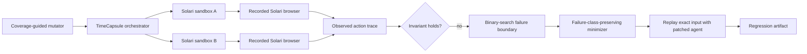

# TimeCapsule

[](https://getsolari.com) [](https://nextjs.org/docs/app) [](https://www.python.org/) [](https://github.com/qeinstein/solari-cookbook/actions/workflows/timecapsule.yml)

> Find the futures where your AI agent fails before your users do.

TimeCapsule treats the future as a fuzzing surface. It uses coverage-guided
mutation to explore payment, dispute, webhook, and wakeup timelines, checks a
safety invariant, binary-searches the failure boundary, minimizes a failing
timeline, and replays the same future against a patched agent. A matched
200-trial benchmark shows a modest breadth benefit for guidance but
no reliable rare-failure speed advantage; see the [search comparison report](../../benchmarks/timecapsule-search-comparison.md).

This is a real Solari use case, not a decorative integration: cloud sandboxes
hold isolated worlds, Solari browsers drive the agent-facing UI, and recorded
sessions preserve the evidence of each run.

## The 90-second demo

```bash
cd examples/timecapsule-py
source .venv/bin/activate
python3 main.py run --futures 25
python3 dashboard/dev.py
```

Open [http://127.0.0.1:3000](http://127.0.0.1:3000), then:

1. Open a red branch and point out the recorded contradiction:
   payment `PAID`, CRM `OVERDUE`, agent belief `OVERDUE`.
2. Click **Minimize**. The candidate visibly collapses to a three-event,
   failure-class-preserving counterexample.
3. Read the **failure boundary**: the webhook lag is binary-searched to the
   first failing minute while every other event remains fixed.
4. Click **Replay exact input**. The fingerprint stays fixed while the result
   changes from original `FAIL` to patched `PASS`.
5. Select a green branch to show that safe futures are inspectable too.

That is the product loop: **FAIL → MINIMIZE → PATCHED PASS**, with the input and
causal state visible rather than implied.

## How it works



The search starts with deterministic seeds, then mutates accepted parents across
payment delay, dispute timing, webhook delay, and wakeup placement. A candidate
is retained when it contributes novel event kinds, adjacent event pairs,
temporal windows, delay buckets, wakeup counts, or failure signatures. The
selected futures form a real parent/child tree with a recorded shared event
prefix. A SHA-256 fingerprint over the ordered event input binds the original
and counterfactual runs.

For every observed failure, TimeCapsule binary-searches the relevant webhook
delay at one-minute resolution. The boundary report includes the last passing
delay and first failing delay, while holding all other events constant. Delta
debugging then preserves the selected failure class, so a dispute counterexample
cannot be minimized into an unrelated payment counterexample.

### Why Solari is essential

- A fresh **Solari sandbox** hosts each future's world state, preventing one
  branch from contaminating another.
- A fresh **Solari browser** drives the real world UI instead of calling an
  in-process mock and records the observed action trace.
- **Session recording** preserves replayable browser evidence when the Solari
  replay is available.
- Failing seeds are run again in new isolated environments with the same event
  fingerprint, so a patch cannot pass by silently changing its test input.

## What you get

- **Deterministic local proof** — fast, repeatable exploration with no API key.
- **Isolated cloud execution** — one Solari sandbox and browser session per
  future, with bounded concurrency for predictable account usage.
- **Temporal evidence** — ordered world actions prove whether contact happened
  before payment or dispute synchronization, even after the final CRM state
  changes.
- **Counterfactual replay** — the same failing future runs against the fixed
  agent and must pass in a fresh isolated environment; the manifest shows that
  world assets, fixtures, initial state, and event input are identical and only
  the agent policy changes.
- **Regression promotion** — save a minimized future as a checked-in JSON case.
- **Recordings** — view the original or patched Solari NDJSON replay directly
  from the dashboard, with keyframe actions shown alongside the proof.
- **Premium dashboard** — a typed Next.js frontend with responsive states,
  accessible controls, restrained motion, and a Python API behind a same-origin
  rewrite.

## The scenario

The vulnerable collections agent trusts stale CRM records. A customer payment
updates the payment system immediately, but the payment webhook arrives later.
Separately, a dispute can be open in the dispute service while its CRM mirror is
still unaware. If the agent wakes during either interval, it sends an incorrect
overdue reminder.

The patched agent verifies the payment source before contacting the customer.
TimeCapsule makes that race explicit and checks the invariant:

```text
no_contact_while_external_state_is_stale
```

## Who needs this

TimeCapsule is for teams whose agents act on state that propagates across
systems and time—not for ordinary request/response unit tests.

- **Collections:** a payment is settled or a dispute is opened, but the CRM
  webhook is delayed; a scheduled collections wakeup sends a reminder in the
  stale interval.
- **Support:** a customer is granted, downgraded, or refunded in the billing
  system while the support entitlement mirror is stale; an agent promises the
  wrong plan or asks the customer to pay again.
- **Ops:** a deploy, rollback, or incident acknowledgement reaches one control
  plane before another; an operations agent pages, restarts, or closes work from
  a mixed-version view of the system.

The collections case is implemented here. Support and ops are concrete
adoption targets, not claims that this example already ships those domains.

## Measured benchmark

These are measured runs from 2026-09-01 on an Apple Silicon machine
(`arm64`, Python 3.14.7, Node 26.3.0), using seed `0`. Failure rate is the
failure rate of the selected search corpus, not an estimate of production
incident prevalence.

| Mode | Futures | Candidates | Virtual horizon | Wall clock | Failure rate | Minimized to | Solari environments |
| --- | ---: | ---: | ---: | ---: | ---: | ---: | ---: |
| Local coverage search | 25 | 1,400 | 116.33 days | 0.1161s | 80.0% | 37.97% | 0 |
| Solari browser/sandbox | 3 | 36 | 15.5 days | 141.8757s | 66.7% | 40.0% | 5 |

The local row was produced with `python3 main.py run --futures 25`; the Solari
row used `python3 main.py solari --futures 3 --concurrency 1`. The Solari run
downloaded five recordings and re-ran both failing futures with fresh sandbox
and browser IDs; both patched replays passed with the same event/environment
hashes, and browser/simulator parity was verified at every event boundary.

## Search benchmark: what guidance actually buys

The benchmark is intentionally part of the submission evidence. Across 200
paired seeds, both strategies received exactly 128 unique candidate
evaluations per trial:

| Strategy | Unique behaviors p25 / median / p75 | Rare hit rate | First rare failure p25 / median / p75 (hits) |
| --- | ---: | ---: | ---: |
| Random mutation | 92 / 95 / 98 | 86.5% | 12 / 29 / 53 |
| Coverage-guided | 97 / 99 / 103 | 91.0% | 12 / 30.5 / 61 |

Guidance won the paired breadth comparison 151–42, with 7 ties. For the rare
failure's first appearance, random won 58 pairs, guidance won 55, and 49 tied
among the 162 pairs where both found it. The honest conclusion is that
coverage guidance broadens the explored surface and slightly raises rare-target
hit rate, but this run does not prove that it finds rare failures faster.

## Quick start: local proof

Requirements: Python 3.10+ and Node.js 20.9+ for the dashboard.

```bash
cd examples/timecapsule-py
python3 -m venv .venv
source .venv/bin/activate
pip install -r requirements.txt

python3 main.py run --futures 25
python3 -m unittest discover -s tests -v
```

The local run writes `runs/latest.json`, minimizes the first failure, and
prints the original-versus-patched result. The generated futures are
deterministic for a given seed, so the checked-in regressions are reproducible:

```bash
python3 main.py regress
```

## Open the dashboard

The UI and API are intentionally separate processes. This keeps the Next.js
frontend deployable as a normal Node.js server while the Python service owns
future execution and filesystem artifacts.

For the smoothest local experience, start both with one command:

```bash
cd examples/timecapsule-py
source .venv/bin/activate
python3 dashboard/dev.py
```

Then open [http://127.0.0.1:3000](http://127.0.0.1:3000). Press `Ctrl-C` to
stop both processes cleanly.

Terminal 1 — API:

```bash
cd examples/timecapsule-py
source .venv/bin/activate
python3 dashboard/server.py --run runs/latest.json --port 8766
```

Terminal 2 — Next.js frontend:

```bash
cd examples/timecapsule-py/dashboard
npm ci
npm run dev
```

Open [http://127.0.0.1:3000](http://127.0.0.1:3000). The app proxies `/api/*`
to `http://127.0.0.1:8766`, avoiding browser CORS configuration. If the API is
elsewhere, copy `dashboard/.env.example` to `.env.local` and set:

```bash
TIMECAPSULE_API_ORIGIN=https://your-api.example.com
```

The Python API exposes `GET /health` for a process-level health check and these
dashboard actions:

| Method | Route | Purpose |
| --- | --- | --- |
| `GET` | `/api/run` | Load the latest persisted exploration |
| `POST` | `/api/futures/:id/compare` | Replay original and patched agents |
| `POST` | `/api/futures/:id/minimize` | Save the smallest failing future |
| `POST` | `/api/futures/:id/regress` | Promote the future into `regressions/` |
| `GET` | `/api/futures/:id/recording/original` | Stream the original Solari NDJSON replay |
| `GET` | `/api/futures/:id/recording/fixed` | Stream the patched Solari NDJSON replay |

## Run with Solari

Set the key in your shell or a secret manager. Never expose it to the browser
or commit it to the repository.

```bash
cd examples/timecapsule-py
source .venv/bin/activate
export SOLARI_API_KEY=slr_live_...
python3 main.py solari --futures 3 --concurrency 1
```

`--concurrency 1` is the safe default for a new or low-limit account. Increase
it only when the account allows more simultaneous sandbox/browser pairs:

```bash
python3 main.py solari --futures 10 --concurrency 2
```

Each future creates and destroys its own sandbox and browser pair. The browser
session is created with recording enabled; after release, TimeCapsule polls
Solari for the rrweb DOM replay and saves available recordings under
`runs/replays/`. The JSON output includes the input fingerprint, violation
snapshot, sandbox ID, browser session ID, preview URL, observed action trace,
recording status, and original/patched evidence. To inspect that cloud run:

```bash
python3 dashboard/dev.py --run runs/solari-latest.json
```

## Verification

Run the same gates used by CI before sharing a change:

```bash
cd examples/timecapsule-py
source .venv/bin/activate
python3 -m unittest discover -s tests -v

cd dashboard
npm ci
npm run lint
npm run typecheck
npm run build
npm run start
```

The suite checks temporal diversity, both safe and unsafe futures, the shared
observed-trace invariant, coverage-guided mutation determinism, matched search
budgets, both failure classes, one-minute boundary search, failure-class-
preserving minimization, canonical fingerprints, regression promotion,
recording serving, browser/simulator parity, partial Solari cleanup, and API
evidence payloads. The Next.js app uses strict TypeScript, a tracked lockfile,
same-origin rewrites, explicit loading and error states, reduced-motion support,
responsive layouts, and selected-future-scoped async evidence state.

The adversarial trust audit is deliberately fail-closed at the cloud boundary:
browser traces must contain complete state evidence and must agree with the
deterministic simulator on final state, message count, and failure class before
the run can report PASS. Counterfactual manifests bind the event input to the
world contract, world asset hash, fixture, and initial state; runtime evidence
also requires a fresh sandbox and browser session for the patched replay.

## Honest boundary

This is a verified technical submission and single-operator demo, not a
multi-tenant hosted service. Before putting untrusted users behind it, add:

- durable run and replay storage instead of local `runs/` files;
- authentication, authorization, request quotas, and per-user isolation;
- a background job queue for long Solari explorations and retry policies for
  transient provider errors;
- structured logs, metrics, alerting, and retention policies for recordings;
- a deployment secret manager for `SOLARI_API_KEY`, plus separate staging and
  production accounts;
- browser end-to-end tests and a credentialed Solari smoke job in CI;
- provider-limit awareness for sandbox/browser budgets and cleanup on worker
  termination.

The local proof intentionally works without a Solari key for fast iteration.
It does not count as cloud evidence; the `solari` command is the path that
proves browser, sandbox, isolation, and recording are materially connected.

## Submission provenance

TimeCapsule lives directly inside the public
[`qeinstein/solari-cookbook`](https://github.com/qeinstein/solari-cookbook)
fork of [`solari-sdk/solari-cookbook`](https://github.com/solari-sdk/solari-cookbook).
It is not a nested or standalone repository.

## Command-line replay workflow

```bash
python3 main.py replay regressions/delayed-payment-webhook.json
python3 main.py minimize regressions/delayed-payment-webhook.json
python3 main.py compare regressions/delayed-payment-webhook-minimal.json
python3 main.py regress
```

## Repository layout

```text
timecapsule-py/
├── dashboard/              # Next.js App Router frontend + Python API
├── regressions/            # minimized, checked-in failure futures
├── timecapsule/            # deterministic world and package CLI
├── world/                  # browser-drivable Solari sandbox world
├── main.py                 # local and cloud execution entrypoint
└── tests/                  # product-loop and API checks
```

## Links

- [Solari Cookbook](https://github.com/solari-sdk/solari-cookbook)
- [Solari documentation](https://docs.getsolari.com)
- [Solari console](https://console.getsolari.com)
- [Next.js App Router](https://nextjs.org/docs/app)

MIT licensed.
